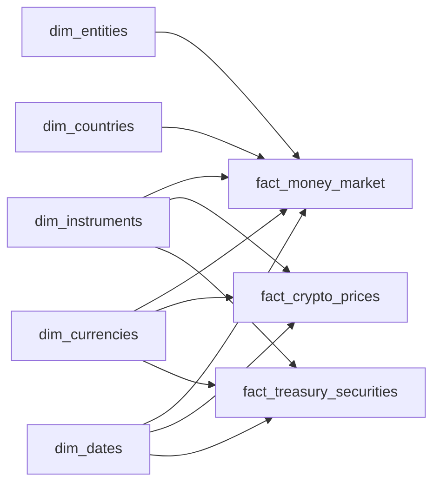

# Financial Data Pipeline for African Economic Data


An automated ETL pipeline system designed to automate data collection processes for PowerBI visualizations of African economic and financial data. This project transforms a 77-minute daily manual workflow into 6 minutes of automated oversight.

## 🚀 Project Overview

### Problem Statement
Manual collection of African financial data from multiple sources (newspapers, PDFs, APIs, web scraping) consuming 77 minutes daily across:
- Money Market Funds (KES & USD)
- Cryptocurrency prices and stablecoin deviations
- Treasury Securities from NSE
- Fixed Deposits rates
- Green Bonds & Carbon Credits
- Market Indexes
- Forex rates

### Solution
Comprehensive automated ETL pipeline with:
- **API-first architecture** for real-time data access
- **Star schema database** optimized for PowerBI analytics
- **Intelligent error handling** with manual fallback capabilities
- **Cross-asset correlation analysis** previously impossible with manual processes
- **10x performance improvement** in PowerBI load times

### Key Results
- ⏱️ **Time Savings**: 77 minutes → 6 minutes daily (92% reduction)
- 🚀 **Performance**: 30+ seconds → 2-3 seconds PowerBI load times
- 📊 **Data Quality**: >99% accuracy with automated validation
- 🔄 **Real-time Updates**: 24/7 automated data refresh vs daily manual updates
- 📈 **Scalability**: Easy addition of new markets and instruments

## 🏗️ Architecture

### Tech Stack
- **Backend**: Python 3.8+, FastAPI, SQLAlchemy 2.0
- **Database**: PostgreSQL with star schema design
- **Data Sources**: yfinance, CoinGecko API, web scraping, PDF processing
- **Analytics**: pandas, technical indicators, cross-asset correlation
- **Deployment**: Docker, Alembic for migrations
- **Monitoring**: Comprehensive logging, quality validation, alerting

### Database Design
**Star Schema optimized for PowerBI performance:**



## 📁 Project Structure

```
Financial_Data_Pipeline/
├── src/
│   ├── collectors/              # Automated data collection
│   │   ├── crypto_collector.py
│   │   ├── treasury_collector.py
│   │   ├── money_market_collector.py
│   │   └── other financial instrument collectors ...
│   ├── transformers/            # Data cleaning & standardization
│   ├── loaders/                 # Database operations with validation
│   ├── models/                  # SQLAlchemy database models
│   ├── api/                     # FastAPI endpoints for PowerBI
│   ├── scheduler/               # Automated pipeline scheduling
│   └── monitoring/              # Quality control & alerting
├── scripts/                     # Pipeline execution scripts
├── tests/                       # Comprehensive testing suite
├── alembic/                     # Database migrations
├── config/                      # Environment configurations
└── docs/                        # Documentation
```

## 🚀 Quick Start

### Prerequisites
- Python 3.8+
- PostgreSQL 13+
- Git

### Installation

1. **Clone the repository**
```bash
git clone https://github.com/Zeus797/financial-data-pipeline.git
cd financial-data-pipeline
```

2. **Set up virtual environment**
```bash
python -m venv .venv
source .venv/bin/activate  # On Windows: .venv\Scripts\activate
```

3. **Install dependencies**
```bash
pip install -r requirements/base.txt
```

4. **Environment configuration**
```bash
cp .env.example .env
# Edit .env with your database credentials and API keys
```

5. **Database setup**
```bash
# Create database
createdb financial_data_pipeline

# Run migrations
alembic upgrade head

# Initialize with sample data
python scripts/setup_database.py
```

6. **Start the API server**
```bash
uvicorn src.api.main:app --reload --host 0.0.0.0 --port 8000
```

### Docker Setup (Alternative)

```bash
# Start all services
docker-compose up -d

# View logs
docker-compose logs -f api
```

## 📊 API Endpoints

### PowerBI-Optimized Endpoints

**Cryptocurrency Data:**
```http
GET /api/v1/crypto/prices?coins=bitcoin,ethereum&period=30d
GET /api/v1/crypto/stablecoins/deviations
GET /api/v1/crypto/technical-indicators?symbol=BTC
```

**Money Market Funds:**
```http
GET /api/v1/money-market/rates?currency=KES&latest=true
GET /api/v1/money-market/comparison?entities=equity,kcb
```

**Treasury Securities:**
```http
GET /api/v1/treasury/bonds?maturity_range=1-5y
GET /api/v1/treasury/yield-curve?date=2025-06-05
```

**Cross-Asset Analytics:**
```http
GET /api/v1/analytics/performance-comparison
GET /api/v1/analytics/correlation-matrix?period=1y
```

### Example Response Format
```json
{
    "data": [
        {
            "instrument_id": 101,
            "symbol": "BTC",
            "record_date": "2025-06-05",
            "price": 67890.12,
            "market_cap": 1340000000000,
            "daily_return": 0.0234
        }
    ],
    "metadata": {
        "total_records": 240,
        "last_updated": "2025-06-05T10:30:00Z"
    },
    "powerbi_schema": {
        "date_column": "record_date",
        "value_columns": ["price", "market_cap"],
        "category_column": "symbol"
    }
}
```

## 🔄 Data Collection Pipeline

### Automated Schedules
- **Cryptocurrency**: Every 4 hours
- **Money Market**: Daily at 6 AM UTC
- **Treasury Securities**: Daily at 6:00 AM UTC
- **Forex Rates**: Every 4 hours (weekdays)
- **Market Indexes**: Every 4 hours (market hours)
- **Green Bonds**: Weekly Thursday 6 AM UTC
- **Fixed Deposits**: Weekly Thursday 6 AM UTC

### Data Sources
- 🪙 **CoinGecko API**: Cryptocurrency prices and market data
- 📄 **NSE PDFs**: Treasury securities via automated PDF processing
- 🌐 **Web Scraping**: Money market rates from financial institutions
- 📊 **yfinance**: Forex rates and market indexes
- 📱 **Google Apps Scripts**: Green bonds and carbon credits integration

### Quality Assurance
- **Real-time validation**: Data quality checks during collection
- **Automated alerts**: Slack/email notifications for pipeline issues
- **Manual fallback**: Excel backup during transition period
- **Performance monitoring**: API response times and data freshness

## 🧪 Testing

### Run Tests
```bash
# Unit tests
pytest tests/unit/ -v

# Integration tests
pytest tests/integration/ -v

# Performance tests
pytest tests/performance/ -v

# All tests with coverage
pytest --cov=src tests/
```

### Test Data
```bash
# Load test data
python scripts/load_test_data.py

# Validate data quality
python scripts/validate_data_quality.py
```

## 📈 Monitoring & Alerts

### Data Quality Monitoring
- **Completeness**: Required field validation
- **Accuracy**: Range and format validation
- **Consistency**: Cross-source data validation
- **Timeliness**: Data freshness monitoring

### Performance Metrics
- **API Response Times**: <100ms average
- **Pipeline Success Rate**: >99%
- **Data Quality Score**: >99%
- **PowerBI Load Times**: <3 seconds

### Alert Channels
- 📧 Email notifications for critical errors
- 💬 Slack integration for pipeline status
- 📊 Dashboard for real-time monitoring

## 🔧 Configuration

### Environment Variables
```env
# Database
DB_HOST=localhost
DB_PORT=5432
DB_NAME=financial_data_pipeline
DB_USER=your_user
DB_PASSWORD=your_password

# API Keys
COINGECKO_API_KEY=your_key
ALPHA_VANTAGE_API_KEY=your_key

# Monitoring
SLACK_WEBHOOK_URL=your_webhook
EMAIL_SMTP_SERVER=smtp.gmail.com
```

### Feature Flags
```yaml
# config/production.yaml
features:
  enable_crypto_collection: true
  enable_treasury_pdf_processing: true
  enable_slack_alerts: true
  
quality:
  stablecoin_deviation_threshold: 0.05
  missing_data_threshold: 0.05
  price_change_alert_threshold: 0.10
```

## 🚀 Deployment

### Production Deployment
```bash
# Build Docker image
docker build -t financial-pipeline:latest .

# Deploy with docker-compose
docker-compose -f docker-compose.prod.yml up -d

# Run database migrations
docker-compose exec api alembic upgrade head
```

### Health Checks
```bash
# API health
curl http://localhost:8000/health

# Database connection
curl http://localhost:8000/health/database

# Data freshness
curl http://localhost:8000/health/data-freshness
```

## 📋 Future Additions

### Advanced Features (Future)
- [ ] Machine learning price predictions
- [ ] Real-time risk analytics
- [ ] Mobile dashboard application
- [ ] Additional African markets expansion

## 🤝 Contributing

### Development Setup
1. Fork the repository
2. Create a feature branch: `git checkout -b feature/your-feature`
3. Install development dependencies: `pip install -r requirements/development.txt`
4. Run tests: `pytest`
5. Commit changes: `git commit -am 'Add new feature'`
6. Push to branch: `git push origin feature/your-feature`
7. Create Pull Request

### Code Standards
- **Python**: Follow PEP 8, use black formatter
- **SQL**: Use snake_case for table/column names
- **API**: RESTful design with OpenAPI documentation
- **Tests**: Minimum 80% code coverage
- **Documentation**: Update README and API docs for changes

## 📄 License

This project is licensed under the MIT License - see the [LICENSE](LICENSE) file for details.

## 🆘 Support

### Documentation
- [API Documentation](docs/api_documentation.md)
- [Database Schema](docs/database_schema.md)
- [Deployment Guide](docs/deployment_guide.md)
- [Troubleshooting](docs/troubleshooting.md)

### Getting Help
- 🐛 **Bug Reports**: Create an issue with detailed description
- 💡 **Feature Requests**: Open an issue with enhancement label
- ❓ **Questions**: Use discussions for general questions
- 📧 **Contact**: davekabera@gmail.com

### Common Issues
- **Database Connection**: Check PostgreSQL service status
- **API Rate Limits**: Verify API keys and rate limiting configuration
- **PowerBI Connection**: Ensure firewall allows connections on port 8000
- **Data Quality**: Check logs in `logs/` directory for validation errors

---

## 🙏 Acknowledgments

- **CoinGecko**: Cryptocurrency market data API
- **Nairobi Securities Exchange**: Treasury securities data
- **PowerBI Community**: Dashboard optimization techniques
- **African Financial Markets**: Data sources and market insights

---

**Made with ❤️ for African Financial Markets**

*Transforming manual data processes into automated intelligence pipelines.*
